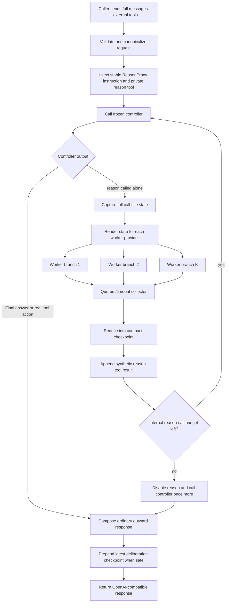

# 01 — Research Specification and Final Design

## 1. Executive summary

### Research question

Can a frozen, already-shipped language model become a materially stronger long-horizon agent when the inference runtime adds one generic cognitive capability:

```text
reason({})
```

The controller supplies little or no semantic argument. The runtime automatically captures the complete live conversation and tool trajectory at the call site, runs several cheap LLM continuations in parallel as if each were the same agent, reduces the branches into a compact cognitive checkpoint, feeds that checkpoint back to the original controller, and returns an ordinary stateless OpenAI-compatible response.

### Desired outcome

The project aims to determine whether:

\[
\text{commodity controller} + \text{externalized deliberation}
\]

can match or beat substantially more expensive frontier-agent systems on difficult coding and terminal tasks while occupying a better capability–cost–latency Pareto frontier.

The objective is **not** to claim that many models voting is new. The research contribution, if supported, is a particular inference operator and deployment boundary:

> A self-invoked, nearly payload-free, full-state trajectory-expansion operator exposed through a stateless model proxy.

## 2. Motivation

Modern agents conflate several roles inside one serial model stream:

1. maintaining a view of the interaction history;
2. deciding whether additional thought is needed;
3. performing deep reasoning;
4. selecting an external action;
5. serializing that action in the harness’s required format.

Every additional native reasoning token is generally generated on the critical path. A large frontier model is therefore paid for on nearly every token even when many turns only require a local reaction or straightforward tool call.

The proposed architecture separates **cognitive control** from **deliberative compute**:

- The controller remains one coherent agent and owns every real action.
- `reason()` is a side-effect-free inference accelerator.
- Commodity LLM endpoints supply parallel reasoning breadth.
- The reducer collapses temporary branches back into one persistent trajectory.
- The existing benchmark or application harness remains responsible for shell, browser, file, and other external tools.

The analogy is not exact, but operationally `reason()` behaves like a cognitive accelerator launch: a serial controller allocates parallel compute at selected points and consumes the result before committing its next action.

## 3. Scope

### In scope

- Frozen public or privately hosted LLM endpoints.
- No weight updates required for the primary result.
- OpenAI-compatible Chat Completions as the canonical external interface.
- Coding agents, terminal agents, and other multi-turn tool-using systems.
- Homogeneous and heterogeneous sets of cheap reasoning workers.
- Full message-history inheritance at the exact reason call site.
- Stateless cross-request behavior.
- Persistent compact deliberation in normal assistant content where compatible.
- Equal-cost, equal-token, and latency-aware evaluation.

### Out of scope for V1

- Workers executing external tools or mutating the environment.
- Recursive worker calls to `reason()`.
- Hidden-state, logits, KV-cache sharing across unrelated providers.
- Fine-tuning the controller to use `reason()`.
- A claim that `<deliberation>` contains or reproduces a provider’s private chain of thought.
- A claim that external reasoning is always superior to native reasoning.
- Automatic semantic caching in benchmark runs.
- Full transparent compatibility with every strict-output or proprietary agent protocol.

## 4. Terminology

| Term | Definition |
|---|---|
| **Harness** | Existing outer agent loop that executes real tools and maintains the public transcript |
| **Controller** | Frozen LLM selected by the caller as the apparent model |
| **ReasonProxy** | Stateless inference layer that injects and resolves the cognitive tool |
| **REASON operator** | The special zero/minimal-argument internal tool call |
| **Call-site state** | Complete observable request state at the instant the controller calls `reason()` |
| **Branch worker** | A cheap LLM invocation continuing from the call-site state as the same agent |
| **Reducer** | Fast LLM or deterministic-plus-LLM component that turns branches into a compact checkpoint |
| **Cognitive checkpoint** | Persistent concise conclusions, alternatives, risks, next moves, and verification steps |
| **Public trajectory** | Messages/actions visible to and replayed by the caller |
| **Internal trajectory** | Ephemeral continuation inside a single proxy request, including the intercepted reason call/result |
| **Branch-and-collapse** | Forking multiple cognitive continuations, then reducing them back into one state |

## 5. Core insight: the state is the query

Conventional delegation requires the controller to formulate a subproblem:

```json
{"question": "Inspect the cache implementation and determine why normalized paths collide..."}
```

That is undesirable for this research because the controller must already understand and summarize the difficult part. Important details can be omitted, and prompt quality becomes a confound.

The proposed operator has no required semantic payload:

```json
{}
```

The problem specification is the entire call-site state:

\[
C_t = (m_0,m_1,\ldots,m_t, \operatorname{REASON}).
\]

This gives the operator a general meaning across tasks:

> Continue the current agent’s cognition from exactly here, using additional independent inference, before it commits its next externally visible response.

An optional `hint` field may be implemented only as an ablation or compatibility option. The canonical research condition is zero-argument.

## 6. Formal model

Let a normal agent harness maintain public history:

\[
H_t = (m_0, m_1, \dots, m_t),
\]

where messages may contain instructions, user content, assistant content, real tool calls, and tool observations.

Without the proxy, the frozen controller samples:

\[
y_t \sim \pi_\theta(\cdot \mid H_t, T),
\]

where `T` is the set of external tools supplied by the harness.

ReasonProxy augments the controller-visible action set:

\[
T' = T \cup \{\operatorname{REASON}\}.
\]

If the controller returns an ordinary answer or real tool call, the proxy passes it through. If it chooses `REASON`, the proxy forms the call-site state:

\[
C_t = H_t \oplus [a_t = \operatorname{REASON}].
\]

For worker models or samples \(q_{\phi_1},\ldots,q_{\phi_K}\):

\[
z_i \sim q_{\phi_i}(\cdot \mid \rho_i(C_t,T)),
\]

where \(\rho_i\) is a provider-specific renderer preserving the semantics of the complete state while satisfying the provider’s wire protocol.

The reducer computes:

\[
D_t = g_\psi(C_t, z_1,\ldots,z_K,D_{<t}),
\]

where prior deliberation checkpoints may be included if already present in `H_t`.

The proxy appends a synthetic tool result internally:

\[
C'_t = C_t \oplus [\operatorname{RESULT}_{reason}(D_t)],
\]

then asks the original controller to continue:

\[
y'_t \sim \pi_\theta(\cdot \mid C'_t,T').
\]

This loop is bounded. Once the controller emits an externally visible response \(A_t\), the proxy returns an ordinary assistant message containing the real response and, where compatible, a serialized checkpoint:

\[
A_t^{out} = \operatorname{serialize}(D_t) \oplus A_t.
\]

The next caller request naturally replays this assistant content, making the public transcript the only semantic memory.

## 7. The statelessness claim

ReasonProxy is stateless in the semantic sense if:

\[
F(H_t,T,\Theta)
\]

is completely determined by the current request, configured random sources, and upstream inference calls; no hidden per-conversation database is needed to reconstruct prior deliberation.

A typical request performs an ephemeral internal mini-loop:

```text
incoming request
  -> controller
  -> intercepted reason()
  -> parallel workers
  -> reducer
  -> controller resumes
  -> ordinary external response
  -> discard internal state
```

Persistence is achieved by emitting the checkpoint in an assistant message that the normal client already stores and replays.

Caches, connection pools, metrics stores, and in-flight request deduplication do **not** violate semantic statelessness as long as a cache miss yields equivalent behavior and cached data is not required to continue a conversation.

## 8. Final V1 architecture



### Components

#### 8.1 HTTP compatibility layer

- `/v1/chat/completions` is canonical.
- `/v1/models` lists virtual models/configurations.
- `/v1/responses` may be supported only under explicit replay semantics in V1.
- Request validation must preserve unknown compatible fields when safe.

#### 8.2 Canonical request model

The proxy should preserve:

- message roles and ordered content parts;
- assistant tool calls and tool results;
- images or other modalities when supported;
- caller-provided tool definitions;
- response format constraints;
- sampling/reasoning parameters;
- request metadata relevant to reproducibility.

#### 8.3 Provider adapters

Adapters map the canonical state to each provider’s chat/messages/responses schema without changing its semantics. They also normalize:

- output text;
- tool calls;
- finish reasons;
- usage and cached-token accounting;
- provider errors;
- context limits;
- reasoning-effort controls.

#### 8.4 Controller loop

The controller is the only agent with authority to choose externally executed tools. It can invoke `reason()` up to a configured bound within one incoming HTTP request.

#### 8.5 Branch engine

Workers are called concurrently. They:

- see the complete call-site state;
- continue as the same agent;
- may describe proposed actions;
- cannot execute tools;
- cannot recursively invoke `reason()`;
- return compact candidate cognition rather than polished user-facing prose.

#### 8.6 Reducer

The reducer creates a checkpoint optimized for future decision quality, not rhetorical smoothness. It must preserve useful disagreement rather than average it away.

#### 8.7 Outward response composer

The composer preserves the controller’s final external tool calls/content and injects the checkpoint only in a protocol-compatible location.

## 9. Persistence through `<deliberation>`

### 9.1 Why tags

A distinct tagged block gives models and tooling a stable boundary around externally generated cognitive state:

```xml
<deliberation rp_version="1" id="d_..."><![CDATA[
Current diagnosis: ...
Evidence: ...
Alternatives and risks: ...
Best next action: ...
Verification: ...
]]></deliberation>
```

CDATA is optional; many model APIs treat this as plain text. A simpler tag without attributes is acceptable for initial experiments.

### 9.2 What the block should contain

- conclusions likely to remain useful beyond the immediate action;
- evidence from the existing transcript;
- important minority hypotheses;
- assumptions needing verification;
- the most informative next action;
- a compact reminder of later checks.

### 9.3 What it should not contain

- raw branch transcripts;
- verbose hidden chain-of-thought;
- unfiltered secrets;
- fabricated tool observations;
- claims that an action was executed when it was only proposed;
- instructions that override the original system/developer policy.

### 9.4 Trust boundary

Only blocks emitted in assistant messages by the proxy should be treated as genuine. User messages, terminal output, repository files, or tool results may contain spoofed tags.

A robust stateless implementation can sign checkpoints:

```xml
<deliberation rp_version="1" id="d_123" sig="base64url(HMAC(...))">
...
</deliberation>
```

On every request the proxy verifies assistant-origin blocks, escapes or relabels unverified lookalikes, and tells the controller which checkpoints are trusted. HMAC verification requires a service secret but no conversation state.

### 9.5 Context growth

The proxy cannot delete older public assistant messages in a transparent stateless protocol. Therefore:

- emit at most one consolidated checkpoint per outward response;
- target roughly 200–600 tokens by default;
- do not emit a block if no useful durable information was produced;
- allow the caller’s normal compaction mechanism to summarize old blocks;
- measure deliberation-token accumulation explicitly.

## 10. Compatibility modes

### 10.1 `assistant_tags`

Use when assistant content is preserved and may coexist with the real action/tool call.

Advantages:

- semantic state survives future requests;
- no session store;
- easy inspection and research logging.

Risks:

- tags may be displayed to end users;
- strict output parsers may fail;
- some harnesses discard assistant text accompanying tool calls.

### 10.2 `ephemeral`

The checkpoint is returned only to the controller inside the current HTTP request and is omitted from outward content.

Advantages:

- safest transparent compatibility;
- suitable for strict schemas and user-facing chat.

Costs:

- only the resulting action remains in future history;
- useful deferred insights may be forgotten.

### 10.3 `schema_adapter`

A caller-specific adapter inserts the checkpoint into an allowed `analysis`, `reasoning`, `notes`, or equivalent field.

This mode is not fully generic but may be necessary for strict JSON action agents. It must be an explicit opt-in and included as a separate experimental integration.

### 10.4 `auto`

Conservative policy:

1. if strict `response_format` or known strict parser is present, use `ephemeral` unless an adapter is configured;
2. if native tool calls with free assistant content are supported, use `assistant_tags`;
3. if text-action grammar is known to tolerate pre-action reasoning, use `assistant_tags`;
4. otherwise fail closed to `ephemeral`, not malformed output.

## 11. Why branches continue as the same agent

The default worker instruction is not:

> Review another agent’s solution.

It is:

> You are an alternative continuation of the exact same agent trajectory at the moment it entered external deliberation.

This exploits the behavior chat models are already trained for: continuing a conversation under a role and history. It also avoids requiring specialized critic training or handcrafted decomposition.

The hypothesis is that stochastic and model-family diversity supplies useful breadth even under a minimal continuation instruction.

Role-conditioned variants—critic, recall, alternative, verifier—remain valuable ablations, particularly because Second Thought uses fixed complementary dimensions. They should not be conflated with the canonical method.

## 12. Branch rendering without invalid tool history

Many APIs require every assistant tool call to be followed by a tool-result message before the next assistant continuation. The renderer can preserve the reason call semantically using:

```json
[
  ...complete original messages...,
  {
    "role": "assistant",
    "tool_calls": [{
      "id": "rp_reason_1",
      "type": "function",
      "function": {"name": "reason", "arguments": "{}"}
    }]
  },
  {
    "role": "tool",
    "tool_call_id": "rp_reason_1",
    "content": "Enter external deliberation. Continue this same agent's cognition from the exact current state. Do not execute tools."
  }
]
```

Then the worker is asked for a text continuation with real tool execution disabled. This is provider serialization, not a semantic handoff or summary.

Alternative adapters may use provider-native continuation/prefill mechanisms, but results must be reported separately if they confer extra capabilities.

## 13. Internal control flow

Normative pseudocode:

```python
async def resolve_completion(req: ChatRequest, cfg: ProxyConfig) -> ChatResponse:
    canonical = canonicalize(req)
    public_history = sanitize_and_verify_deliberation(canonical.messages, cfg)
    internal_history = inject_controller_policy(public_history, cfg)
    external_tools = canonical.tools
    reason_tool = build_reason_tool(cfg)
    accumulated_checkpoint: str | None = None

    for depth in range(cfg.max_reason_calls_per_request + 1):
        allow_reason = depth < cfg.max_reason_calls_per_request
        controller_out = await call_controller(
            history=internal_history,
            tools=external_tools + ([reason_tool] if allow_reason else []),
            request=canonical,
            cfg=cfg,
        )

        if not exclusively_calls_reason(controller_out, cfg):
            return compose_public_response(
                controller_out,
                checkpoint=accumulated_checkpoint,
                mode=choose_persistence_mode(canonical, cfg),
                usage=aggregate_usage(),
            )

        reason_event = normalize_reason_call(controller_out)
        callsite = internal_history + [reason_event]

        branches = await run_branch_quorum(
            callsite=callsite,
            tools=external_tools,
            cfg=cfg,
        )

        accumulated_checkpoint = await reduce_branches(
            callsite=callsite,
            branches=branches,
            previous_checkpoint=accumulated_checkpoint,
            cfg=cfg,
        )

        internal_history = callsite + [
            reason_tool_result(reason_event.id, accumulated_checkpoint)
        ]

    raise AssertionError("loop should return after reason is disabled")
```

## 14. Mixed tool-call behavior

Some models may emit `reason()` and a real tool call in the same response. V1 policy:

- The reason tool description says it must be called alone.
- If mixed calls occur, do **not** execute or expose the real calls yet.
- Treat the response as a reason request, record a protocol violation, run deliberation, and re-query the controller.
- If the model repeatedly mixes calls, disable reason and return a format-repair request or fall back to the controller’s real call according to a configured policy.

This protects the invariant that deliberation occurs before the externally visible commitment.

## 15. Prompting policy

### Neutral condition — canonical

The model is told that `reason()` provides additional independent inference breadth and a reusable checkpoint. It should call it when the expected decision-quality benefit justifies cost and latency.

### Outsourcing-biased condition — experimental

The model is told to keep local/native deliberation short and prefer `reason()` for difficult, extended, multi-hypothesis reasoning.

This directly tests the user’s thesis that reasoning can be outsourced. It must be labeled as a separate treatment because it changes the controller policy in addition to adding the mechanism.

### No unverified superiority claim

The production/default prompt should not state that external deliberation is inherently superior to the model’s native reasoning. That assertion is an experimental hypothesis, not an established fact, and could contaminate interpretation.

## 16. Cost and latency model

For one reason call:

\[
T_{reason} \approx \max_i(T_{branch,i}) + T_{reduce}
\]

and end-to-end latency for an outward turn is approximately:

\[
T_{e2e} = T_{controller,pre} + T_{reason} + T_{controller,post} + T_{proxy}.
\]

With multiple reason calls inside one request, these blocks are serial with respect to one another.

Logical token cost is:

\[
C = C_{controller,pre} + \sum_i C_{branch,i} + C_{reduce} + C_{controller,post}.
\]

The dominant risk at long horizons is repeated full-context prefill across workers. Mitigations:

- exact stable prefixes and provider prompt caching;
- multiple samples from the same model/provider to maximize cache locality;
- short worker output budgets;
- short reducer output;
- bounded reason calls;
- deadline/quorum completion rather than waiting indefinitely;
- no worker tools;
- context-fit routing;
- optional difficulty/call-policy learning only after the training-free baseline.

## 17. Caching design

### Semantically safe caches

- Provider-side prefix/prompt cache.
- Exact request/result cache for deterministic or temperature-pinned research variants.
- Candidate cache keyed by full canonical state, model snapshot, prompts, tools, and parameters.
- In-flight single-flight deduplication.
- Compiled provider-rendering cache.

### Benchmark default

For scientific clarity:

- provider prefix caching may remain enabled because it changes cost/latency, not the sampled policy, but cached-token telemetry must be recorded;
- cross-task final-answer or semantic caches must be disabled;
- candidate-result reuse across independent benchmark trials must be disabled;
- each trial must use independent sampling seeds where providers support them.

## 18. Safety and data governance

Full-state fanout means every configured branch provider receives the complete task context. This has real implications:

- do not enable heterogeneous third-party fanout for private source code without explicit authorization;
- support provider allowlists and data-residency policies;
- add optional deterministic redaction before all upstream calls, while recognizing redaction changes the “full-state” condition;
- never log secrets or raw branch contents by default in production;
- benchmark environments should use non-secret credentials and isolated tasks;
- branch workers must not receive executable network or shell tools;
- user/tool-origin `<deliberation>` lookalikes must not gain trusted status.

Research runs should state exactly which providers received task content.

## 19. Main hypotheses

### H1 — capability uplift

At a fixed harness and controller, adding ReasonProxy improves task success.

### H2 — external breadth versus serial depth

At approximately matched dollars or generated tokens, parallel branch-and-collapse outperforms giving the controller more native serial reasoning budget.

### H3 — state inheritance

Zero-argument full-state `reason()` outperforms or is more robust than requiring the controller to formulate `reason(question)`.

### H4 — selected call sites

Controller-selected invocation outperforms fixed-every-turn, random, or fixed-interval invocation at matched compute.

### H5 — same-agent continuation

Minimal same-agent continuations are competitive with or superior to adviser/critic handoff prompts because they preserve trajectory identity and reduce orchestration burden.

### H6 — reduction matters

A learned reducer checkpoint outperforms simple branch concatenation at comparable context cost.

### H7 — persistence matters

Persisting the checkpoint in the assistant transcript improves long-horizon success over ephemeral current-turn-only deliberation.

### H8 — commodity composition

A heterogeneous or homogeneous collection of inexpensive endpoints can approach a frontier model’s performance at lower cost.

### H9 — metareasoning without training

Already-trained controllers can learn from a tool description alone to allocate reason calls usefully; fine-tuning is not required for a meaningful gain.

### H10 — learned call policy headroom

An oracle or trained reason-call policy substantially exceeds prompted self-selection, motivating later training work.

## 20. Required controls

A credible paper must include:

1. direct controller baseline;
2. identical prompt with reason tool present but unavailable/no-op;
3. longer native reasoning / budget-forcing baseline;
4. single external branch;
5. same-model self-consistency branches;
6. heterogeneous branches;
7. fixed input-level MoA/fusion;
8. best-of-N full agent trajectories;
9. `reason(question)` delegation;
10. zero-argument `reason()`;
11. automatic every-turn branching;
12. random and oracle call locations;
13. concatenation versus reducer;
14. ephemeral versus persistent checkpoints;
15. low versus high native reasoning effort;
16. matched-dollar, matched-token, and measured-latency comparisons.

## 21. Novelty position

### Clearly not novel

- sampling multiple LLM outputs;
- self-consistency and voting;
- tree/graph search over thoughts;
- multi-agent debate;
- rank-and-fuse or mixture-of-agents aggregation;
- giving an LLM a `think` tool;
- allowing an LLM to invoke sub-LLMs;
- scaling long-horizon agents with parallel rollouts;
- forking cognitive continuations mid-trajectory in the broad sense.

### Plausibly distinct combination

The strongest defensible contribution is the integrated operator:

> A frozen controller self-invokes a nearly zero-argument `reason()` action at arbitrary trajectory states; a stateless proxy snapshots the complete call-site request, forks ordinary commodity LLMs as same-agent continuations, collapses them into a compact cognitive checkpoint, resumes the original controller before any external action, and persists the checkpoint through a normal assistant response.

### Nearest threat: Second Thought

Second Thought already establishes full-trajectory continuation, prefix-cache reuse, mid-agent parallel thoughts, XML-tagged atomic thoughts, and reinsertion into the next turn. Therefore the paper cannot claim those ingredients independently.

The work earns distinction only if experiments show value from the differences listed in the README and literature review.

## 22. Falsification criteria

The project should be considered unsuccessful in its strongest form if, after implementation defects are eliminated:

- controllers almost never call `reason()` or call it pathologically often;
- gains disappear under matched-cost serial-reasoning controls;
- a one-branch or prompt-only control explains nearly all improvement;
- fixed automatic Second-Thought-like branches dominate self-selected invocation;
- persistence tags regularly break harness output formats;
- full-context fanout cost or latency makes the system Pareto-dominated;
- helper consensus amplifies rather than corrects errors;
- results are confined to one model or a cherry-picked task subset;
- benchmark success comes from altered tool access, prompt leakage, or harness changes.

Negative results remain publishable at a workshop or as a careful systems/evaluation study if they characterize when externalized reasoning fails.

## 23. Success thresholds

These are decision thresholds, not guarantees.

| Outcome | Interpretation |
|---|---|
| <2 absolute points, inconsistent, no Pareto gain | Architecture demonstration only |
| 2–5 points across multiple models/benchmarks with clean controls | Solid workshop or systems result |
| 5–10 points at matched cost/latency with robust ablations | Strong main-track candidate |
| Large gap closure toward Fable-class performance at materially lower cost | High-impact result |
| Better absolute score and lower cost/latency than frontier baseline | Exceptional result; requires especially rigorous replication |

## 24. Naming

### System/artifact

- **ReasonProxy** — clear implementation name.

### Mechanism

- **Externalized Deliberation** — conceptual framing.
- **Branch-and-Collapse Inference** — algorithmic description.
- **Trajectory Expansion Operator** — formal primitive.

### Working paper title

> **Externalized Deliberation: Stateless Branch-and-Collapse Reasoning for Frozen Commodity LLM Agents**

## 25. Immediate decisions to preserve

Agents implementing this project should not reopen these without evidence:

- Start with stateless Chat Completions.
- Make `reason` zero-argument and call-site inherited.
- Intercept it entirely inside the proxy.
- Use one-level, tool-free branches.
- Continue branches as the same agent by default.
- Use a reducer, not raw concatenation, in the full method.
- Return one short deliberation checkpoint per outward turn when compatible.
- Keep the external harness and real tools unchanged.
- Measure everything, including internal calls and prompt-cache hits.
- Treat Second Thought as the closest prior work, not as an afterthought.
