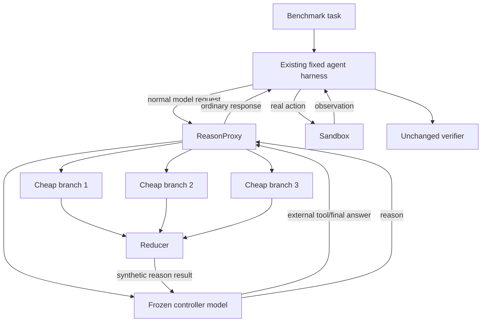

# 04 — Benchmark and Evaluation Plan

## 1. Purpose

This document explains how common agentic benchmarks are actually executed, where ReasonProxy fits, and how to evaluate the method without accidentally comparing different agents, different tool interfaces, or different amounts of compute.

The central rule is:

> **Hold the benchmark, environment, harness, prompts, external tools, and controller model fixed. Change only the model endpoint from the direct provider to ReasonProxy.**

The proxy is not the benchmark harness. It is a model-side inference transformation placed at the ordinary model API boundary.

## 2. What an agentic benchmark contains

Coding and terminal benchmarks generally do **not** merely send one prompt to an LLM endpoint and grade its final text. A useful abstraction is:

\[
\text{evaluation system}
=
\text{dataset/tasks}
+
\text{sandbox}
+
\text{agent harness}
+
\text{model endpoint}
+
\text{verifier}.
\]

### 2.1 Dataset or task specification

A task usually contains:

- a natural-language instruction;
- a repository, filesystem, terminal, game, or application state;
- resource and time limits;
- hidden tests or a programmatic grader;
- sometimes reference artifacts that are never shown to the agent.

### 2.2 Sandbox

The sandbox executes commands and isolates tasks. It may be Docker, a remote VM, a cloud sandbox, or a benchmark-specific environment. ReasonProxy does not replace it.

### 2.3 Agent harness

The harness repeatedly:

1. constructs the current model prompt/messages;
2. calls the selected model endpoint;
3. parses the model's response into an action;
4. executes that action in the sandbox;
5. appends the observation to its trajectory;
6. repeats until submission, success, timeout, or failure.

Examples include mini-SWE-agent, Terminus-2, Proximus, OpenHands, and benchmark-specific ARC agents.

### 2.4 Model endpoint

This is where ReasonProxy fits. The harness already expects to call a provider or an OpenAI-compatible service. In the treatment condition, it calls ReasonProxy instead:

```text
CONTROL
benchmark harness -> GLM/Kimi endpoint

TREATMENT
benchmark harness -> ReasonProxy -> same GLM/Kimi endpoint
```

### 2.5 Verifier

The verifier grades the resulting repository patch, terminal state, files, game score, or other observable behavior. It should be kept unchanged.

## 3. Integration model

### 3.1 External and internal actions

The benchmark harness owns external actions:

```text
shell, tmux, read_file, edit_file, submit, browser, game_action, ...
```

ReasonProxy adds exactly one internal cognitive action:

```text
reason({})
```

The proxy intercepts `reason()` and resolves it inside the same HTTP request. The benchmark never executes it and ideally never knows it exists.



### 3.2 Why a proxy is scientifically useful

A custom reasoning agent could improve performance merely because its planner, action parser, compaction policy, or tool prompts are better. A proxy experiment allows a stronger paired comparison:

```text
same task instance
same agent implementation and commit
same system/task prompt
same external tools and parser
same controller model and sampling policy
same timeout and turn limit
same verifier

only difference:
  direct model endpoint
  versus ReasonProxy-wrapped endpoint
```

This does not eliminate every confound—the proxy injects instructions and uses more inference—but it makes those differences explicit and ablatable.

## 4. Compatibility gate before benchmarking

The proxy has three persistence modes. Each benchmark/harness must pass a conformance test before scores are trusted.

| Mode | Description | When to use |
|---|---|---|
| `assistant_tags` | Return `<deliberation>` in ordinary assistant content alongside the real action | Harness replays assistant text and permits text plus tool/action |
| `ephemeral` | Use external deliberation only to improve the current action; do not persist a block | Strict response grammar or parser discards text |
| `schema_adapter` | Store a checkpoint in a harness-approved structured field | Small, explicit integration for a known schema |

### 4.1 Required conformance checks

For every harness/model combination, run a synthetic two-turn task and verify:

1. The proxy can add `reason()` without colliding with an existing tool name.
2. A controller `reason()` call is intercepted and never executed by the harness.
3. The eventual real action is parsed exactly as in the direct baseline.
4. Assistant text returned alongside the real action is preserved in the next request when `assistant_tags` is enabled.
5. `<deliberation>` does not corrupt JSON, XML, shell-command, or structured-output parsing.
6. Multiple tool calls, parallel tool calls, and finish reasons are handled deterministically.
7. The final submission action still works.
8. Context compaction either preserves the checkpoint or is explicitly treated as part of the fixed harness.
9. Errors and timeouts are attributed to the correct layer.
10. Token/cost accounting includes controller, branches, reducer, and retries.

A failed conformance test means use `ephemeral`, write a narrow schema adapter, or exclude that integration. Do not silently modify the harness parser after observing benchmark outcomes.

## 5. Benchmark-by-benchmark integration

## 5.1 DeepSWE — recommended first serious target

### What it is

DeepSWE is an original long-horizon software-engineering benchmark. Its public repository currently describes 113 tasks across TypeScript, Go, Python, JavaScript, and Rust, with isolated environments and program-based verifiers. Tasks use Harbor's task format, and official quickstarts run them with Pier and mini-SWE-agent.

Primary sources:

- https://github.com/datacurve-ai/deep-swe
- https://github.com/datacurve-ai/pier
- https://github.com/SWE-agent/mini-swe-agent

### How it runs

Conceptually:

```text
DeepSWE task
  -> Pier runner
  -> mini-SWE-agent
  -> selected model/API
  -> repository/tool actions
  -> isolated patch collection
  -> pristine verifier container
```

A representative direct run is:

```bash
pier run \
  -p /path/to/deep-swe/tasks \
  --agent mini-swe-agent \
  --model <provider>/<controller-model>
```

mini-SWE-agent supports model backends through LiteLLM and can be configured with a custom API base. The exact flags should be pinned to the versions checked into the experiment repository rather than copied indefinitely from this document.

### ReasonProxy integration

Preferred first integration:

```text
mini-SWE-agent -> OpenAI-compatible ReasonProxy -> GLM-5.3 or Kimi K3
```

Use the same mini-SWE prompt/config for both conditions. Configure only endpoint/model alias/API key differences.

Alternative for debugging only: a native mini-SWE model class wrapping the same core Reason Engine. Use it to diagnose transcript issues, but the primary generality demonstration should use the HTTP proxy.

### Why DeepSWE first

- The task count is large enough for meaningful paired analysis.
- Tasks are long-horizon enough for mid-trajectory deliberation to matter.
- The agent is model-agnostic rather than tied to a proprietary CLI.
- Verification is behavioral and isolated.
- Full trajectories can be inspected.
- Runs are more tractable than 20-hour FrontierSWE tasks.

### Initial protocol

1. Pin DeepSWE, Pier, and mini-SWE-agent commits.
2. Run 3–5 trivial/synthetic compatibility tasks.
3. Preselect a 10–20 task pilot without using treatment outcomes.
4. Run at least three paired trials per condition in the pilot.
5. Fix only implementation defects, not outcome-specific prompts.
6. Freeze V1 configuration and preregister the full matrix.
7. Run the full 113-task evaluation at the chosen number of trials.

## 5.2 Terminal-Bench 2.1

### What it is

Terminal-Bench evaluates agents on difficult tasks in containerized command-line environments. Terminal-Bench 2.1 is run through Harbor. Its repository specifies an agent and model separately, for example:

```bash
harbor run \
  -d terminal-bench/terminal-bench-2-1 \
  -a <agent> \
  -m <provider/model> \
  -k 5
```

Primary sources:

- https://github.com/harbor-framework/terminal-bench-2-1
- https://www.harborframework.com/docs

The public repository states that leaderboard submissions currently require at least five trials per task and that community submissions are presently closed; this does not prevent local research evaluation.

### Fixed harness recommendation

Use **Terminus-2** as the primary fixed harness because Harbor describes it as a neutral reference agent for terminal model evaluation. It uses a mono-tool tmux interface and accepts a custom `api_base`.

Source:

- https://www.harborframework.com/docs/agents/terminus-2

### Important parser issue

Terminus-2 can use JSON or XML response parsers and performs its own history summarization. Therefore:

- first test whether `assistant_tags` survives its selected parser;
- do not prepend arbitrary text inside a strict JSON payload;
- use `ephemeral` or a schema-specific field if needed;
- record whether Terminus compaction preserves or discards deliberation blocks;
- keep Terminus summarization settings identical across control and treatment.

Do **not** alter the parser only for the treatment condition. If an adapter is needed, direct and proxy conditions must traverse the same adapter except for the reason feature.

### Recommended protocol

```text
Control:   Terminus-2(commit X) + controller direct
Treatment: Terminus-2(commit X) + ReasonProxy(controller)
```

Record the Harbor dataset revision, sandbox provider/image, agent arguments, parser, turn limit, reasoning effort, and summarization thresholds.

## 5.3 Terminal-Bench-Science

Terminal-Bench-Science is useful as a difficult transfer benchmark because its tasks require scientific computing and sustained terminal interaction. It should be attempted after the core implementation is stable; low baseline success can make pilot conclusions noisy.

Primary sources:

- https://terminal-bench-science.ai/
- https://github.com/laude-institute/terminal-bench-science

Use the benchmark's prescribed harness and trial count. Do not mix scores from differing agents or sandbox configurations. Current public leaderboard values may motivate model selection, but the paper should report reruns under the study's fixed configuration or label external snapshots clearly.

## 5.4 FrontierSWE v2 — high-value, expensive target

### What it is

FrontierSWE v2 currently describes 34 ultra-long-horizon tasks, with runs able to continue for up to 20 hours. Its evaluation uses **Proximus**, a minimal coding-agent harness purpose-built for these tasks. Some tasks include visual inputs or benefit from vision.

Primary sources:

- https://www.frontierswe.com/blog/v2
- https://github.com/Proximal-Labs/frontier-swe

The launch snapshot dated September 2026 reports a large score gap between Claude Fable 5.1 and lower-cost public models. Treat these numbers as motivation, not as an internally controlled comparison.

### Integration rule

Keep Proximus fixed:

```text
Control:   Proximus + GLM/Kimi direct
Treatment: Proximus + same model through ReasonProxy
```

Do not replace Proximus with a custom agent and claim a model-side improvement.

### Special requirements

- Support image/multimodal message parts before running vision-relevant tasks.
- Preserve Proximus time-awareness and submission mechanics.
- Decide whether branch workers receive images directly, image descriptions, or only text; preregister this.
- Measure provider rate limits and branch fan-out under 20-hour trajectories.
- Use a task subset only for engineering validation; reserve the official aggregate for the frozen full run.
- Budget for multiple trials because individual long tasks have high variance.

### Why it matters

A substantial movement on FrontierSWE under fixed Proximus would be more compelling than small gains on an easier or saturated benchmark. It is also expensive enough that adaptive `reason()` allocation and cost accounting become central rather than cosmetic.

## 5.5 ARC-AGI-3 — interactive transfer benchmark

ARC-AGI-3 is an interactive reasoning-game benchmark. The public developer harness uses provider/model configurations, stores trajectories and checkpoints, and supports common API styles.

Primary sources:

- https://github.com/ARCAGI-Labs/arc-agi-3-benchmarking
- https://arcprize.org/competitions/2026/arc-agi-3

Potential integration:

```yaml
provider: openai_compatible
base_url: http://reasonproxy:8000/v1
model: reason/glm-5.3
```

or a thin provider adapter if its OpenAI-compatible path lacks a needed feature.

ARC-AGI-3 tests whether the mechanism generalizes beyond coding. It should be secondary because the initial prompts/reducer are optimized only for generic trajectory continuation, and multimodal/game-state rendering needs careful validation.

## 5.6 ARC-AGI-2 — not a primary target

ARC-AGI-2 is principally a static grid-transformation benchmark. It can test branching reasoning, but it does not exercise the long-horizon tool trajectory and self-selected mid-course invocation that motivate ReasonProxy. It is suitable as a later general-reasoning ablation, not as the first headline result.

## 6. Experimental conditions

A credible study needs more than `baseline` versus `our method`.

### 6.1 Core condition matrix

| ID | Condition | Purpose |
|---|---|---|
| A | Direct commodity controller | Raw baseline |
| B | Direct controller + injected instructions/tool schema, tool disabled/no-op | Measures prompt/schema perturbation |
| C | Controller + one external same-agent branch | Isolates delegation from ensemble breadth |
| D | Controller + N homogeneous branches + reducer | Tests same-model trajectory sampling |
| E | Controller + N heterogeneous cheap branches + reducer | Tests model diversity |
| F | Controller + N branches concatenated without reducer | Tests whether reduction matters |
| G | Fixed MoA at every model turn | Tests self-selected placement versus always-on fusion |
| H | Explicit `reason(question)` delegation | Tests whether payload formulation helps or harms |
| I | Zero-argument full-state `reason()` | Canonical method |
| J | Automatic Second-Thought-style branching at fixed boundaries | Closest mechanism baseline |
| K | Best-of-N complete agent rollouts | Standard agentic test-time scaling baseline |
| L | Additional serial native reasoning at matched budget | Tests breadth versus depth |
| M | Frontier model under the same harness | Capability target, not a compute-matched baseline |

Not every full benchmark must contain every condition. Use a staged plan:

- all conditions on a predeclared representative subset;
- the most informative 4–6 conditions on full benchmark suites;
- mechanism-specific ablations on cheaper replayable/synthetic tasks.

### 6.2 Call-placement ablations

Compare:

1. controller-selected calls;
2. automatic call every turn;
3. fixed periodic calls every `k` turns;
4. random calls matched to the same count distribution;
5. heuristic calls after errors/test failures;
6. oracle calls selected retrospectively from a small development set.

The oracle condition estimates headroom and must never be reported as a deployable method.

### 6.3 Branch-policy ablations

Compare:

- natural same-agent continuations with only stochastic/model diversity;
- homogeneous same-model samples;
- heterogeneous model families;
- fixed cognitive roles such as critic/alternative/verifier;
- dynamically selected branch prompts;
- short branch budget versus long branch budget;
- one fast branch returned early versus quorum/all branches.

The canonical V1 should remain simple: natural same-agent continuations, one level, no tools.

### 6.4 Reducer ablations

Compare:

- majority vote when an answer is discrete;
- raw concatenation;
- deterministic deduplication plus concatenation;
- fast generative cognitive checkpoint;
- controller itself receives all branches;
- larger reducer;
- reducer blind to branch model identity versus model-labelled branches.

The reducer must preserve disagreement rather than hallucinating consensus.

### 6.5 Persistence ablations

Compare:

- `ephemeral`: checkpoint used only before current action;
- `assistant_tags`: checkpoint returned and replayed;
- concise controller-authored post-deliberation plan only;
- schema adapter;
- no checkpoint, only selected next action.

This distinguishes immediate action improvement from longer-term cognitive memory.

### 6.6 Native reasoning ablations

For providers exposing reasoning effort, evaluate at least:

```text
low native reasoning + no external deliberation
high native reasoning + no external deliberation
low native reasoning + external deliberation
high native reasoning + external deliberation
```

Do not assume `low + external` will win. The experiment tests substitution and complementarity.

## 7. Fair compute comparisons

## 7.1 Three distinct budgets

Report at least three resource views:

1. **Dollar cost** using actual billed input/cache-hit/output usage at run time.
2. **Total model tokens** separated into controller input/output, branch input/output, and reducer input/output.
3. **Wall-clock latency** including queueing, retries, sandbox time, and proxy overhead.

No single budget is sufficient. Parallel branches can use many tokens without proportionally increasing latency, and cached input can change dollar cost without changing logical token count.

## 7.2 Equal-dollar control

For each target budget `B`, compare systems constrained to approximately the same cost:

\[
\max \operatorname{Success}(S) \quad \text{subject to}\quad \operatorname{Cost}(S)\le B.
\]

Possible control: spend the external branch/reducer budget on additional serial output tokens or higher native reasoning effort from the same controller.

## 7.3 Equal-token control

Count uncached logical tokens as well as billed tokens. A branch system should be compared against a serial controller allowed a similar total generated-token budget where technically possible.

Caveat: tokenizers differ across providers, so exact cross-model token equality is not semantically perfect. Report provider-native tokens and normalized dollar/latency curves rather than collapsing everything into one misleading count.

## 7.4 Equal-latency control

Define service-level budgets such as:

```text
interactive: p95 model-side response <= 5 s
balanced:    p95 model-side response <= 15 s
max-quality: no tight model-side deadline, benchmark timeout still fixed
```

For long-running coding tasks, also report end-to-end task completion time. Faster decisions can reduce the number of turns, while reason calls add model-side delay; both effects matter.

## 7.5 Same-harness frontier comparison

A frontier model comparison should use the same task, agent, prompt, and limits. Public leaderboard numbers from a different harness are contextual only.

## 8. Statistical design

### 8.1 Unit of analysis

The primary unit is the **task instance**, not an individual LLM call.

For binary pass/fail, each condition should run paired trials on the same task set. Pair seeds/order where the provider permits it, while recognizing remote APIs may remain nondeterministic.

### 8.2 Trial count

Use benchmark-prescribed trial counts when submitting or comparing to official protocols. For internal pilots:

- 3–5 trials/task is a practical starting point;
- rare success rates may need more;
- FrontierSWE's cost may force a hierarchical/staged design.

### 8.3 Confidence intervals

Report confidence intervals over tasks and trials, preferably with a paired bootstrap that resamples tasks and then trials within tasks. For a single paired binary outcome per task, McNemar's test can supplement but not replace effect-size intervals.

### 8.4 Multiple comparisons

Predeclare:

- one primary comparison;
- one primary benchmark;
- one primary metric;
- a limited set of secondary hypotheses.

Treat the large ablation grid as exploratory unless corrected for multiplicity. Do not select the best worker/reducer configuration on the test tasks and report its unadjusted score.

### 8.5 Development, validation, and test partitions

Prefer:

- synthetic tasks and a small explicitly marked development subset for implementation;
- a validation subset for selecting branch count/prompts;
- the remaining tasks or official hidden evaluation for the frozen result.

When a benchmark has no suitable split, select development tasks before treatment runs and report that contamination limitation.

## 9. Metrics

## 9.1 Primary outcome

- pass rate / task success under the unchanged verifier.

## 9.2 Resource outcomes

- total actual cost per task and per successful task;
- model-side and end-to-end wall-clock time;
- p50/p95/p99 request latency;
- input, cache-hit input, output, and reasoning tokens by component;
- provider requests, retries, cancellations, and failures;
- peak and average concurrency.

## 9.3 Mechanism outcomes

- number and location of `reason()` calls;
- fraction of turns that call `reason()`;
- branch completion/quorum rate;
- branch disagreement and unique-insight measures;
- reducer length and compression ratio;
- fraction of checkpoint content later reflected in an action;
- action changed relative to a replayed no-reason counterfactual, where measurable;
- repeated/redundant reason calls;
- context growth attributable to deliberation tags;
- deliberation survival through harness compaction.

## 9.4 Reliability outcomes

- malformed controller responses;
- real tool-call parse failures;
- reason-tool protocol failures;
- reducer failures;
- provider rate-limit and timeout rates;
- benchmark infrastructure failures;
- tasks invalidated by verifier/environment bugs.

## 9.5 Pareto reporting

Plot and tabulate:

\[
\text{success versus dollars},
\quad
\text{success versus total latency},
\quad
\text{success versus generated tokens}.
\]

Also report cost per successful task:

\[
\operatorname{CPS}=\frac{\text{total run cost}}{\text{number of passed task trials}}.
\]

Do not hide dominated configurations behind a single averaged score.

## 10. Pilot sequence

### Stage 0 — protocol conformance

Use fake providers and tiny deterministic tasks. No benchmark claims.

### Stage 1 — five-task smoke test

Run direct and proxy conditions once to identify serialization, parser, submission, timeout, and accounting bugs.

### Stage 2 — preregistered 10–20 task pilot

Suggested minimum conditions:

```text
A direct controller
B injection/no-op control
C one same-agent branch
D four homogeneous branches + reducer
E heterogeneous branches + reducer
L matched serial native reasoning
```

Use 3–5 trials/task. Inspect trajectories only after aggregate pilot completion unless a run is clearly an infrastructure failure.

### Stage 3 — freeze V1

Freeze:

- proxy commit;
- controller and model snapshots;
- worker list;
- reducer;
- prompts;
- sampling settings;
- context and persistence policy;
- deadlines/retries;
- benchmark and harness commits;
- statistical plan.

### Stage 4 — full DeepSWE and Terminal-Bench

Run the primary comparison and a limited number of key baselines.

### Stage 5 — expensive/high-gap validation

Run FrontierSWE v2 and/or Terminal-Bench-Science after mechanism evidence exists.

### Stage 6 — cross-domain transfer

Use ARC-AGI-3 or another fixed-harness interactive environment.

## 11. Failure-mode taxonomy

Manual trajectory analysis should label failures without changing the frozen run:

| Category | Example |
|---|---|
| Controller never invokes reason | Tool-use policy failure |
| Controller over-invokes reason | Metareasoning/budget failure |
| Branches repeat controller misconception | Correlated reasoning failure |
| Branches discover issue, reducer drops it | Reduction failure |
| Reducer memo is useful, controller ignores it | Integration failure |
| Deliberation causes distraction/overthinking | Negative inference scaling |
| Immediate action improves, later insight is lost | Persistence failure |
| Tags corrupt action parser | Compatibility failure |
| Context growth causes compaction/loss | Memory-budget failure |
| Provider tail latency dominates | Systems failure |
| Benchmark environment/verifier is defective | Evaluation infrastructure failure |

This taxonomy is more informative than pass/fail alone and can guide a later trained reason-call policy.

## 12. Reproducibility requirements

Every run manifest should record:

```yaml
run_id: ...
timestamp_utc: ...
reasonproxy_git_sha: ...
benchmark_repo_git_sha: ...
harness_repo_git_sha: ...
dataset_revision: ...
agent_name: ...
agent_config_hash: ...
controller:
  provider: ...
  model: ...
  snapshot_or_version: ...
  sampling: ...
  native_reasoning_effort: ...
workers: [...]
reducer: ...
prompts_hash: ...
persistence_mode: ...
branch_count: ...
max_reason_calls_per_request: ...
request_deadlines: ...
provider_price_snapshot: ...
sandbox_image_digest: ...
trial_seed_or_nonce: ...
```

Store:

- raw public harness trajectory;
- proxy internal event trace with secrets removed;
- all branch/reducer outputs for analysis;
- usage and latency events;
- verifier artifacts;
- exact config and prompt files;
- infrastructure-failure adjudications.

## 13. Contamination and integrity

- Never send hidden tests, verifier code, or reference solutions to branch workers.
- Branches receive only what the controller legitimately sees in the current messages.
- Avoid web access unless the benchmark permits it equally across conditions.
- Do not use benchmark task content to tune the reducer except on a declared development split.
- Pin model/provider versions where possible; if a provider silently updates a model, split the experiment by date/version.
- Record cache policy. Disable semantic response caching for benchmark correctness runs.
- Randomize run order across conditions to reduce temporal provider-load bias.
- Blind manual failure annotation to condition when practical.

## 14. Decision criteria

### Engineering success

- A full benchmark run completes through the proxy with no extra parser/submission failures.
- Costs and latencies reconcile with provider usage.
- Replayed assistant checkpoints survive in compatible harnesses.

### Scientific signal

A useful early signal would be a consistent paired gain with confidence intervals that exclude trivial effects, without a worse cost/latency frontier than obvious controls.

### Strong publication-level result

A strong result would show most of the following:

1. large, consistent gains on at least two long-horizon benchmarks;
2. gains over matched serial native reasoning;
3. gains over one external continuation and fixed always-on MoA;
4. competitive or better cost per success than a frontier model;
5. evidence that self-selected call sites matter;
6. reproducibility across at least two commodity controller families;
7. a clear explanation of when the method hurts;
8. direct comparison to Second Thought or a faithful boundary-matched approximation.

### Negative but valuable result

The project remains informative if it establishes, with adequate controls, that:

- commodity branches are too correlated;
- reducer loss dominates;
- controller metareasoning is poor without training;
- external deliberation helps only immediate decisions but not full task success;
- latency/cost erases quality gains;
- native reasoning already dominates at matched compute.

Such a result should be reported honestly rather than hidden behind selected tasks.

## 15. Recommended primary study

A defensible first paper can center on:

```text
Primary benchmark: DeepSWE full suite
Primary controller: one pinned commodity model
Primary treatment: zero-argument, model-selected reason(), four branches, fast reducer
Primary comparator: direct controller at matched harness
Primary outcome: paired task success
Primary resource axis: actual dollars per successful task

Secondary:
- matched serial native reasoning
- one branch
- homogeneous vs heterogeneous branches
- Second Thought-like automatic boundary baseline
- Terminal-Bench 2.1 replication
- second commodity controller family
```

FrontierSWE v2 then serves as the ambitious high-gap validation rather than the first place implementation bugs are discovered.
